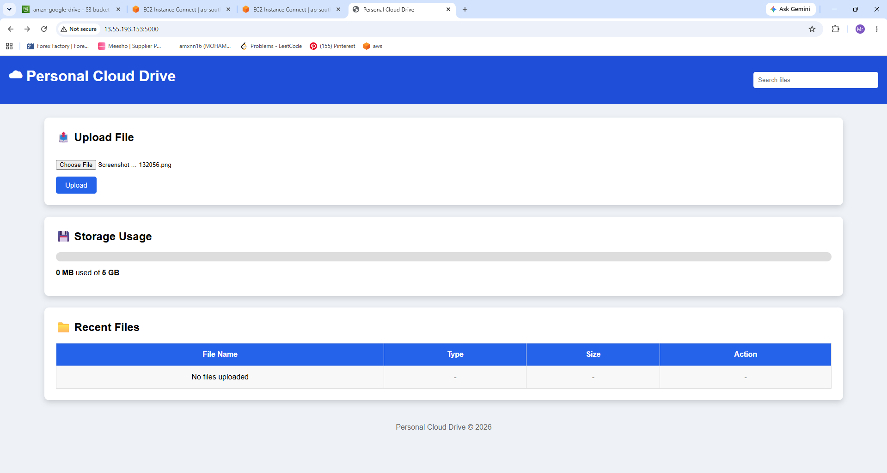
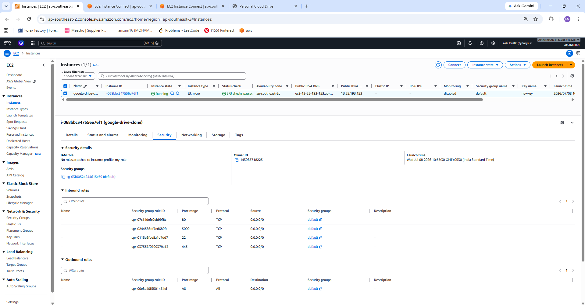
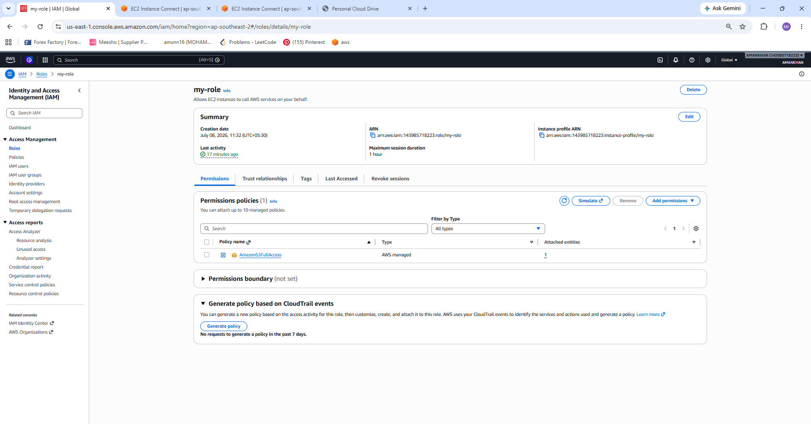
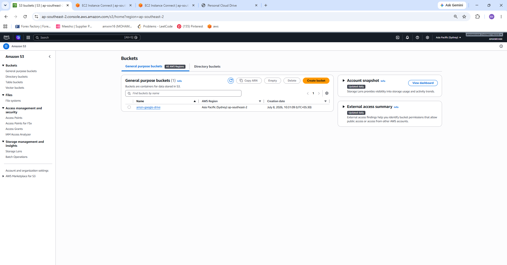
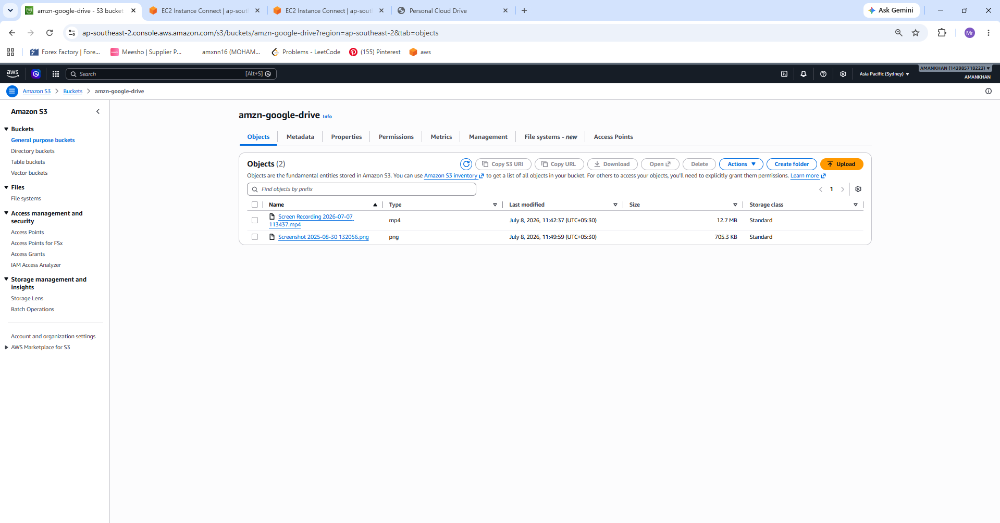

# ☁️ Google Drive Clone

A simple **Google Drive Clone** built using **Python, HTML, AWS EC2, IAM Role, and Amazon S3**.

This project allows users to upload files through a web interface. The uploaded files are securely stored in an **Amazon S3 Bucket** using an **IAM Role** attached to the EC2 instance, eliminating the need to store AWS Access Keys inside the application.

---

# 🚀 Features

- 📁 Upload files from a web interface
- ☁️ Store uploaded files in Amazon S3
- 🔒 Secure authentication using IAM Role
- 🌐 Hosted on AWS EC2 Instance
- 🐍 Backend developed using Python
- 🎨 Frontend developed using HTML
- ⚡ Lightweight and simple architecture

---

# 🛠️ Technologies Used

- Python
- HTML
- AWS EC2
- Amazon S3
- IAM Role
- Boto3 (AWS SDK for Python)

---

# 🏗️ Architecture

```
                User
                  │
                  ▼
          HTML Web Application
                  │
                  ▼
          Python Backend (Flask)
                  │
                  ▼
        EC2 Instance (IAM Role)
                  │
                  ▼
           Amazon S3 Bucket
```

---

# 📂 Project Structure

```
google-drive-clone/
│
├── app.py
├── index.html
├── README.md
│
└── screenshots/
    ├── IAM-role.png
    ├── ec2-instance.png
    ├── objects-from-output-to-s3.png
    ├── output.png
    └── s3-bucket.png
```

---

# 📸 Screenshots

## Application Output



---

## EC2 Instance



---

## IAM Role Attached to EC2



---

## Amazon S3 Bucket



---

## Uploaded Objects in S3



---

# ⚙️ How It Works

1. User opens the web application hosted on EC2.
2. User selects a file.
3. Python backend receives the file.
4. Boto3 uploads the file to Amazon S3.
5. Authentication is handled automatically through the EC2 IAM Role.
6. The uploaded file appears inside the configured S3 bucket.

---

# 🔐 AWS Services Used

### Amazon EC2
Hosts the Python web application.

### Amazon S3
Stores uploaded files securely.

### IAM Role
Provides secure permissions for EC2 to access S3 without using AWS Access Keys.

---

# ▶️ Running the Project

Clone the repository

```bash
git clone https://github.com/amn-khn/google-drive-clone.git
```

Go to the project directory

```bash
cd google-drive-clone
```

Install dependencies

```bash
pip install flask boto3
```

Run the application

```bash
python app.py
```

Open your browser

```
http://<EC2-Public-IP>:5000
```

---

# 🔒 Security

This project follows AWS best practices by:

- Using IAM Roles instead of Access Keys
- No AWS credentials stored in source code
- Secure communication between EC2 and Amazon S3

---

# 📈 Future Improvements

- User Authentication
- File Download
- File Delete
- Folder Support
- Progress Bar
- Multiple File Upload
- File Preview
- Responsive UI
- Database Integration

---

# 👨‍💻 Author

## MOHAMMED AMANKHAN

Computer Science Engineer

GitHub:
https://github.com/amn-khn

---

# 📜 License

MIT License

Copyright (c) 2026 MOHAMMED AMANKHAN

Permission is hereby granted, free of charge, to any person obtaining a copy
of this software and associated documentation files (the "Software"), to deal
in the Software without restriction, including without limitation the rights
to use, copy, modify, merge, publish, distribute, sublicense, and/or sell
copies of the Software, and to permit persons to whom the Software is
furnished to do so, subject to the following conditions:

The above copyright notice and this permission notice shall be included in all
copies or substantial portions of the Software.

THE SOFTWARE IS PROVIDED "AS IS", WITHOUT WARRANTY OF ANY KIND, EXPRESS OR
IMPLIED, INCLUDING BUT NOT LIMITED TO THE WARRANTIES OF MERCHANTABILITY,
FITNESS FOR A PARTICULAR PURPOSE AND NONINFRINGEMENT. IN NO EVENT SHALL THE
AUTHORS OR COPYRIGHT HOLDERS BE LIABLE FOR ANY CLAIM, DAMAGES OR OTHER
LIABILITY, WHETHER IN AN ACTION OF CONTRACT, TORT OR OTHERWISE, ARISING FROM,
OUT OF OR IN CONNECTION WITH THE SOFTWARE OR THE USE OR OTHER DEALINGS IN THE
SOFTWARE.
